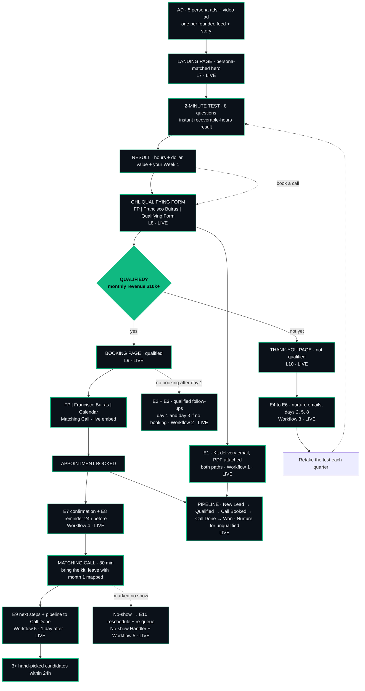

# FP | Francisco Buiras | Business Map

The full funnel journey from ad to call, with every step linked to its real asset.
Updated October 7: the build is complete, so the map is green end to end. The remaining
work is evidence capture (screenshots, Loom), noted honestly at the bottom — not fake links.

## How to put this in Notion (5 minutes)

1. Open your existing page (title: **FP | Francisco Buiras | Business Map**), delete the old diagram and table.
2. Type `/code`, choose **Mermaid** as the language, and paste the diagram block below.
3. Under the diagram, add a table (`/table`) with the four columns below (Step, Asset, Link, Status) and paste the rows in. Select each link and use "Add link" so they're clickable.
4. Top right: **Share → Publish → Publish to web**. The judges' link must open without a login, so it has to be the public publish, not a private share.
5. Copy the published URL. That is index line **L3 · Business Map**.

## The journey (paste into a Mermaid block)

## Step by step, with the real asset behind each

| Step | Asset | Link | Status |
|------|-------|------|--------|
| 1. Ad (5 personas, one argument each) | 5 static ads (feed + story) + 19s video ad + 5 CTA variants; each opens the landing on its persona hero (`?p=dan` `?p=vanessa` `?p=chris` `?p=sofia`, ad 5 default) | Drive folder FP_FranciscoBuiras_L13_Ads | LIVE |
| 2. Landing page (persona-matched hero) | React app on GitHub Pages, real Pareto branding | https://francisco12-a11y.github.io/Final-Project/ | LIVE |
| 3. 2-minute test (8 questions) | Built into the landing, section #quiz, no email to see the number | https://francisco12-a11y.github.io/Final-Project/#quiz | LIVE |
| 4. Test result (hours, dollars, Week 1) | Same page, instant; pre-fills the kit's Week 1 and the form | same URL as step 3 | LIVE |
| 5. Qualifying form | GHL form **FP \| Francisco Buiras \| Qualifying Form**, embedded at #get-audit; conditional logic inside the form routes by revenue | Same URL as step 2, section #get-audit | LIVE |
| 6. Qualification gate | Revenue-only: Pre-revenue and Under $10K → thank-you; everything else → booking. Hours and hiring authority saved to the contact as data | set inside the form's conditional logic | LIVE |
| 7a. Qualified → booking page | Booking page: the call, the 24h candidate promise, the guarantees | https://francisco12-a11y.github.io/Final-Project/qualified.html | LIVE |
| 7b. Not qualified → thank-you page | Kit confirmed, "You didn't get a booking link. That's on purpose." | https://francisco12-a11y.github.io/Final-Project/thank-you.html | LIVE |
| 8. Lead magnet | The Right Hand Starter Kit PDF (5 pages), hosted on the site, delivered by email | https://francisco12-a11y.github.io/Final-Project/lead-magnet/FP_FranciscoBuiras_L06_RightHandStarterKit.pdf | LIVE |
| 9. Opt-in workflow | Workflow 1: opportunity in New Lead ($3,000) → tag qualified or nurture → E1 kit email with PDF attached (both arms) → internal notification | GHL, published | LIVE |
| 10. Qualified follow-up | Workflow 2: day 1 check → E2, day 3 check → E3; booked leads are never chased | GHL, published | LIVE |
| 11. Nurture | Workflow 3: E4, E5, E6 on days 2, 5, 8 — teach-only, each ends with the retake link | GHL, published | LIVE |
| 12. Booking | Workflow 4: tag booked, opportunity to Call Booked, E7 confirmation, E8 reminder 24h before (calendar-filtered) | GHL, published | LIVE |
| 13. Matching Call calendar | **FP \| Francisco Buiras \| Calendar** — 30 min, live embed on the booking page | calendar embed on step 7a | LIVE |
| 14. Post-call + no-show | Workflow 5: 1 day after → Call Done + E9 next steps; No-show Handler → E10 reschedule + re-queue into the qualified follow-up | GHL, published | LIVE |
| 15. Pipeline tracking | Lead Magnet Pipeline: New Lead → Qualified → Call Booked → Call Done → Won (Matched); unqualified leads sit in Nurture | GHL, published | LIVE |
| 16. Second Brain (research behind every step) | Public export of the vault, 67 notes | https://francisco12-a11y.github.io/Final-Project/second-brain/ | LIVE |

## Honest status, in one list

- **L11/L12 evidence**: the end-to-end execution screenshots are being captured into the Drive folders (the builds themselves are live — the screenshots are the remaining work).
- **L15 Loom**: not recorded yet; the script is done.
- **Extra mile in progress**: the same funnel rebuilt natively in GHL (`FP | Francisco Buiras | Qualified Path Funnel`).
- Everything marked LIVE above is clickable and opens without a login.

## Source of truth

Site source: https://github.com/francisco12-a11y/Final-Project · Kit PDF: `public/lead-magnet/` · GHL spec: `project-docs/build_ghl_spec_pdf.py` → PDF in Descargas.
