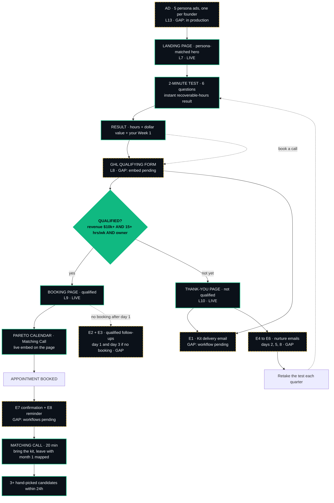

# FP | Francisco Buiras | Business Map

The full funnel journey from ad to call, with every step linked to its real asset.
Gaps are marked honestly: 🚧 means built or specced but not live yet, nothing is faked.

## How to put this in Notion (5 minutes)

1. New Notion page, title it **FP | Francisco Buiras | Business Map**.
2. Type `/code`, choose **Mermaid** as the language, and paste the diagram block below.
3. Under the diagram, add a table (`/table`) with the four columns from the journey table below (Step, Asset, Link, Status) and paste the rows in. Select each link and use "Add link" so they're clickable.
4. Top right: **Share → Publish → Publish to web**. The judges' link must open without a login, so it has to be the public publish, not a private share.
5. Copy the published URL. That is index line **L3 · Business Map**.

## The journey (paste into a Mermaid block)

## Step by step, with the real asset behind each

| Step | Asset | Link | Status |
|------|-------|------|--------|
| 1. Ad (5 variants, one per persona) | Persona ad set, each links to the landing with its persona tag (`?p=dan` … `?p=sofia`) | GAP — in production this week | 🚧 Gap |
| 2. Landing page (persona-matched hero) | React app on GitHub Pages | https://francisco12-a11y.github.io/Final-Project/ | LIVE |
| 3. 2-minute test (6 questions) | Built into the landing, section #quiz | https://francisco12-a11y.github.io/Final-Project/#quiz | LIVE |
| 4. Test result (hours, dollars, Week 1) | Same page, instant, no email needed | same URL as step 3 | LIVE |
| 5. Book a call → qualifying form | GHL form embed (spec: GHL Build Spec PDF, section 4) | GAP — Fran building in GHL | 🚧 Gap |
| 6. Qualification screen | Form conditional redirect (revenue $10k+ AND 15+ hrs AND owner) | Rules in the GHL Build Spec PDF, section 4 | 🚧 Gap |
| 7a. Qualified → booking page | Booking page with the real Pareto calendar | https://francisco12-a11y.github.io/Final-Project/qualified.html | LIVE |
| 7b. Not qualified → thank-you page | Thank-you page: kit delivered, no booking link | https://francisco12-a11y.github.io/Final-Project/thank-you.html | LIVE |
| 8. Lead magnet | The Right Hand Starter Kit PDF | https://francisco12-a11y.github.io/Final-Project/lead-magnet/FP_FranciscoBuiras_L06_RightHandStarterKit.pdf | LIVE |
| 9. Opt-in workflow (deliver, tag, opportunity, notify) | GHL workflow 1 + email E1 | Build spec PDF, section 5 | 🚧 Gap |
| 10. Qualified follow-up (2 emails if no booking) | GHL workflow 2 + emails E2, E3 | Build spec PDF, section 6 | 🚧 Gap |
| 11. Nurture (3 emails) | GHL workflow 3 + emails E4, E5, E6 | Build spec PDF, section 7 | 🚧 Gap |
| 12. Booking confirmation + reminder | GHL workflow 4 + emails E7, E8 | Build spec PDF, section 8 | 🚧 Gap |
| 13. Matching Call | Pareto calendar embed (live) on the booking page | same link as step 7a | LIVE |
| 14. Pipeline tracking | Lead Magnet Pipeline, 6 stages | Build spec PDF, section 2 | 🚧 Gap |

## Honest gaps, in one list

- **L13 Ads**: 5 persona ads in production (copy + imagery this week).
- **L8 Form + workflows + emails in GHL**: fully specified in the GHL Build Spec PDF; build in progress.
- **L11/L12 screenshots**: produced by the end-to-end test after the GHL build.
- **L14 Imagery**: page placeholders live; generation prompts this week.
- Everything marked LIVE above is clickable and opens without a login.

## Source of truth

Site source: https://github.com/francisco12-a11y/Final-Project · Kit PDF: `public/lead-magnet/` · GHL spec: `project-docs/build_ghl_spec_pdf.py` → PDF in Descargas.
